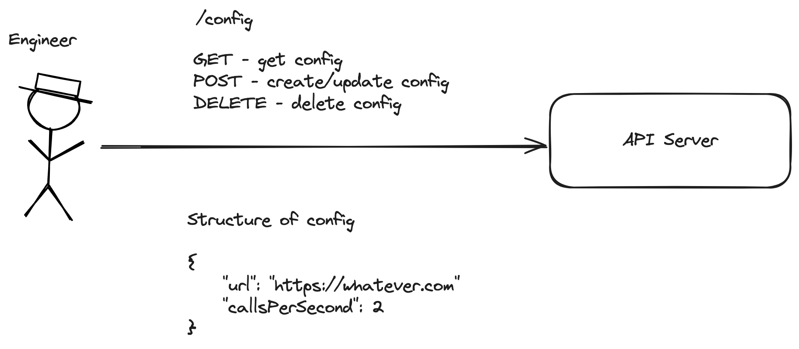

# Task 1 - Implement CRUD operations for a simple configuration on a server.

Your first task is to implement the logic for three endpoints on an API server, which allows a user to create (POST), read (GET), update (also POST), and delete (DELETE) a configuration on a server.



Endpoint details:

### Server Endpoints

1. **POST `/config`**
   - **Purpose**: Submit a new configuration for the server.
   - **Payload Example**:
     ```json
     {
       "url": "https://example.com/api/whatever",
       "callsPerSecond": 2
     }
     ```
   - **Behavior**: Upon receiving the config, the server should save the configuration in memory. If a config is already present, it should be overwritten with the new config.
2. **GET `/config`**
   - **Purpose**: Retrieve the current configuration.
   - **Returns**: JSON object detailing the current configuration stored by the server. Returns an empty (204) response if there is no configuration present.
3. **DELETE `/config`**
   - **Purpose**: Remove the current configuration
   - **Behavior**: Removes the currently stored configuration from memory and returns an empty (204) response.