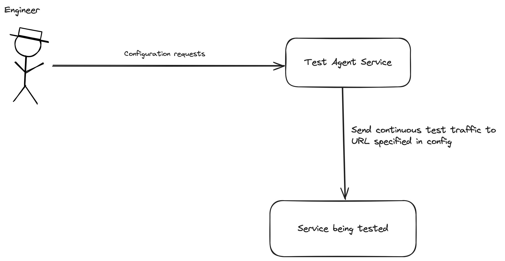

# Task 2 - Implement Test Agent Service

Now you should add code so the API Server can be used as a test agent to send traffic to some other server, based on its configuration parameters. i.e. An engineer should be able to tell the server to send test traffic to https://google.com at two requests per second and the server should immediately start sending that traffic until it is told to stop.




### Additional endpoint logic

In addition to the previous CRUD logic...

1. **POST `/config`**
   - **Behavior**: Should start sending traffic to the specified URL at the specified number of callsPerSecond.
2. **GET `/config`**
   - **Behaviour**: (No additional behaviour to before)
3. **DELETE `/config`**
   - **Behavior**: Causes the Test Agent Service to stop sending test traffic.

### Sending test requests

Please use the mocked request sending function which we have provided in `request_sender.ts`. This will not send real traffic, but will send requests which will either succeed or fail at random.

In addition, please log when a request has been send, including the time in the log line.

Here is an example of some code to send a test request:

```ts
const responseStatus = await sendRequest("<some url>");
console.log(new Date().toLocaleString(), "Received response with status code", responseStatus);
```